# Other Magic Items

## Edmund’s Eye Patch
**Wondrous Item, rare (requires attunement)**

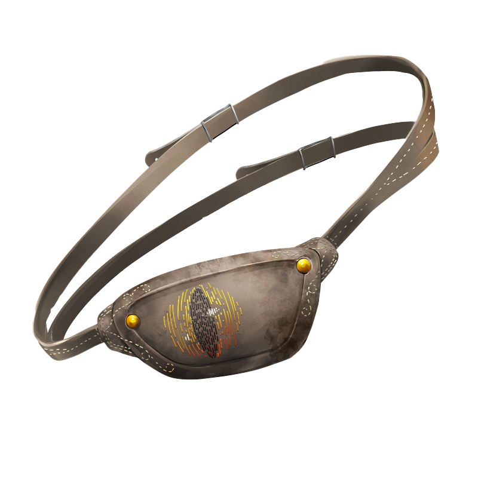

While wearing this eye patch, you gain these benefits:
You have advantage on Wisdom (Perception) checks that rely on sight.
If you have the Sunlight Sensitivity trait, you are unaffected by the trait.
You are immune to magic that allows other creatures to read your thoughts or determine whether you are lying. Creatures can communicate telepathically with you only if you allow it.

## Dust of Sleeping
**Wondrous Item, rare**

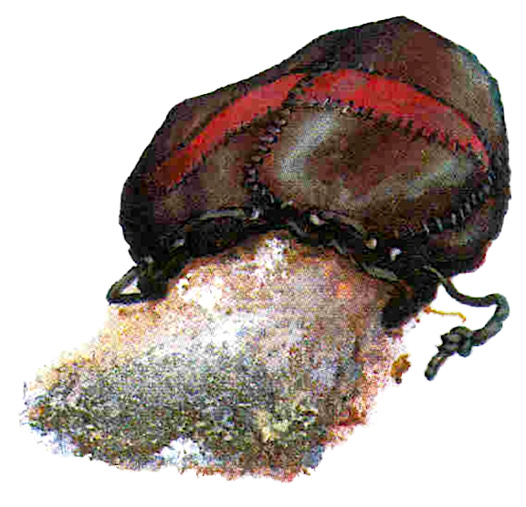

Usually found in a small leather sack, this powder resembles fine, white sand. There is enough of it for one use. When you use an action to throw a handful of the dust into the air, each creature that needs to breathe within 10 feet of you must succeed on a DC 15 Constitution saving throw or fall unconscious for 1 minute, until the sleeper takes damage, or someone uses an action to shake or slap the sleeper awake. You are immune to the effect.

## Boots of the Trail
**Wondrous Item, uncommon**

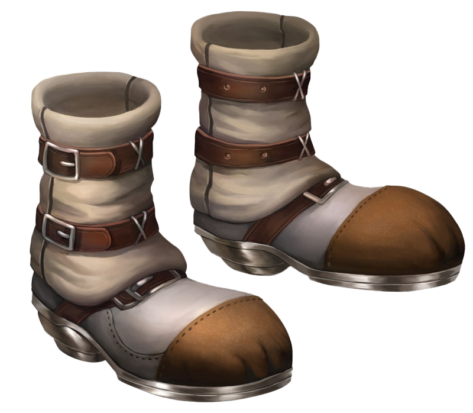

Until they are worn, the boots of the trail appear to be in grave disrepair. When you lace them up, the illusion fades: they are immaculate hiking boots with gold clasps and silk laces. While wearing these boots, you leave behind no tracks or other traces of your passage, and can’t be tracked except by magical means. You can march for twice as long before suffering levels of exhaustion.
Additionally, you can remove the boots and speak a command word (Vroom vroom) as an action to cause the boots to walk alone, leaving a false trail in any direction for up to one mile. The boots then teleport back to your feet.

## Cane of Youth
**Wondrous Item, uncommon (requires attunement)**

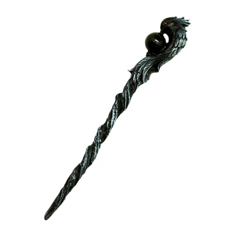

While attuned to this cane, you suffer none of the frailty of old age and can’t be aged magically. You can still die of old age, however.

## Bracelet of Animal Speech
**Wondrous Item, rare (requires attunement)**

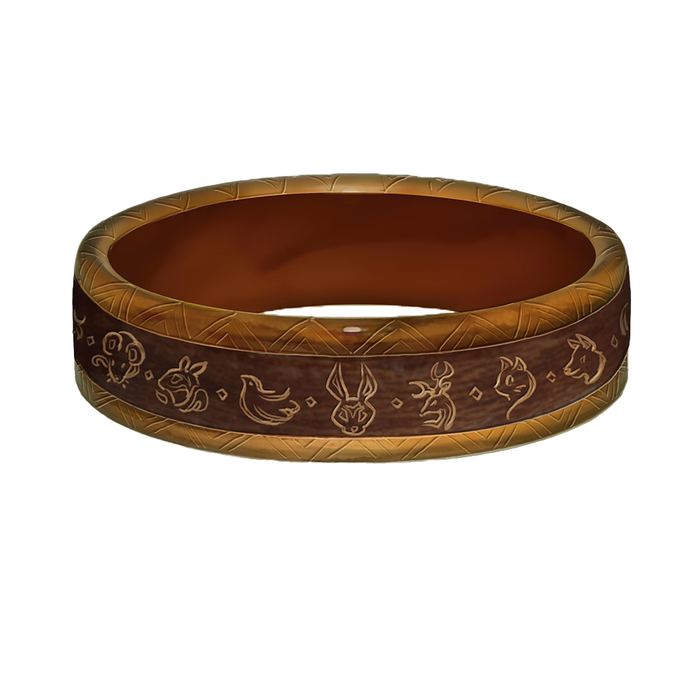

When you place this item on your wrist, you gain the ability to comprehend and verbally communicate with one beast of your choice. A side effect is that you can no longer speak any other language, but can only make the noise, such as a bark or meow, of the last beast you spoke to.This effect lasts while you have the bracelet on your wrist.
The knowledge and awareness of many beasts is limited by their intelligence, but at minimum, beasts can give you information about nearby locations and monsters, including whatever they can perceive or have perceived within the past day. You might be able to persuade a beast to perform a small favor for you, at the DM’s discretion.

## Key of Opening
**Wondrous item, uncommon (6)**

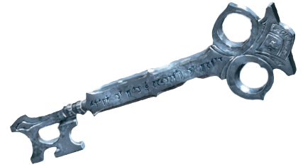

This bronze key has a head shaped like a crown. When inserted into a non magical lock and twisted, the key expends a charge and opens the lock. The key has 6 charges when found and becomes non magical when you use the last charge.

## Exploding Armor
**Armor (medium, half plate), rare (requires attunement)**

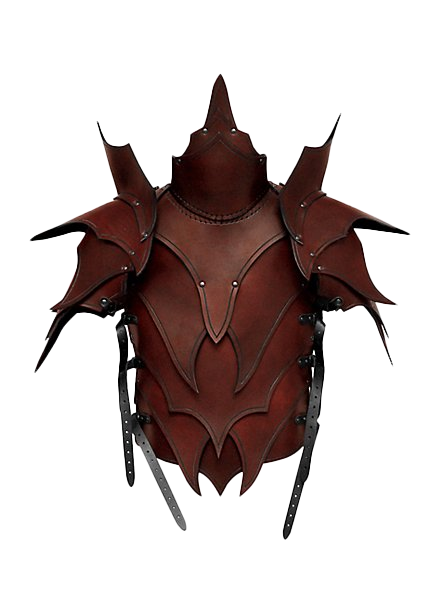

While wearing this armor, you can use your action to cast fireball (save DC 15), centered on yourself. You take no damage from this spell. The armor cant be used this way again until the next dawn.

## Magical Four Leaf Clover
**Wondrous item, very rare (requires attunement)**

While attuned to this item you gain the following benefits:
<ul>
<li>
You have advantage against being charmed or frightened
</li>
<li>
You have resistance to non magical bludgeoning, piercing, and slashing damage
</li>
<li>
You have advantage on stealth and sleight of hand rolls
</li>
<li>
Your attacks become critical hits on a 7 in addition to your normal critical hit range
</li>
<!-- <li>
While your effective HP (normal + temp) is under 20% of your maximum HP you gain the following benefits:
<ul>
<li>You have advantage on attack rolls and saving throws</li>
<li>You are unaffected by difficult terrain</li>
<li>Your movement speed is doubled</li>
<li>You may reroll any one d20 (can only be done once per long rest)</li>
</ul>
</li> -->
</ul>

## Lord's Clothes
**Wondrous item, common**

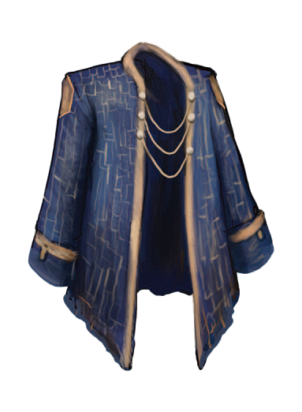

While wearing these lavish clothes, you have advantage on all Charisma (Deception) checks made to impersonate a noble.

## Philosopher’s Crown
**Wondrous item, uncommon (requires attunement)**

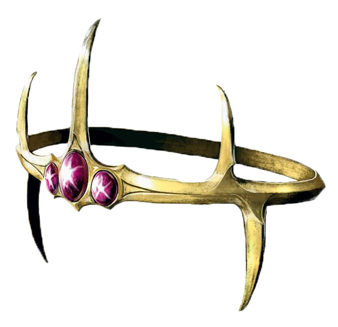

While wearing the crown, you have advantage on Arcana, History, Nature, and Religion checks. In addition, if you make one of the above skill checks and dislike the result, you can reroll the die. You must use the second result. Once you use this power, you can’t use it again until you finish a long rest.

## Ear Cuff of the Vampire Bat
**Wondrous item, uncommon (requires attunement)**

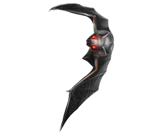

While wearing this dark ceramic ear cuff, your Wisdom (Perception) checks that rely on hearing are made with advantage. In addition, whenever you make a Wisdom (Perception) check that involves hearing, you can choose to command the ear cuff to momentarily enhance your senses. When you do, its eyes flash with a piercing red glow as the bat’s ceramic fangs bite down on your ear. You take 1d4+1 necrotic damage from its bite, and immediately gain a bonus to your Wisdom (Perception) check equal to the amount of necrotic damage taken in this way. This damage ignores any resistance or immunity to necrotic damage. You can decide to use this ability after you roll the d20, but before the GM determines the outcome.

## Clawed Slippers
**Wondrous item, uncommon**

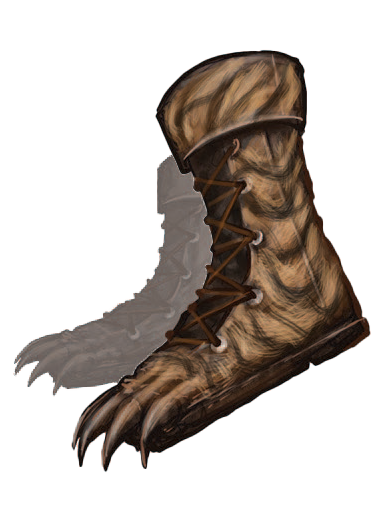

These fluffy slippers are made from the pelts of rare, magical felines. While wearing these slippers, you gain a climbing speed equal to half your walking speed. Additionally, once per day, you may choose to double your walking speed until the end of your turn (no action required). Once this property has been used, it cannot be used again until the following dawn.

## Mirror Shield
**Armor (shield), uncommon (requires attunement)**

While holding this shield, ranged spell attacks have disadvantage against you. On a roll of 1, this shield reflects the spell back at the caster.

## Glasses of Ignorance
**Wondrous item, common (requires attunement)**

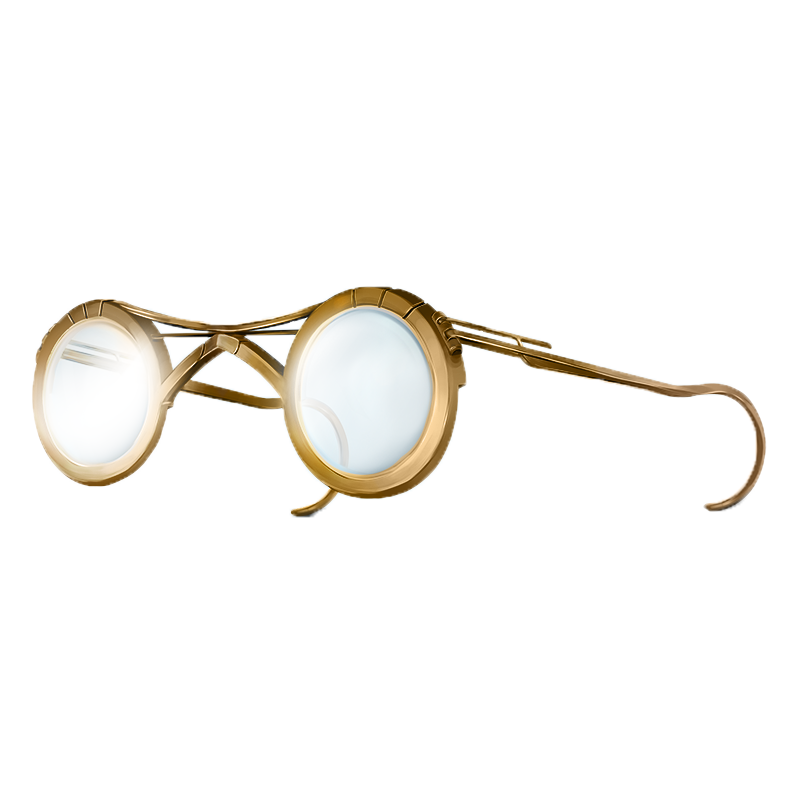

While attuned to these glasses you can choose one thing (creature or object) to be invisible to the wearer.

These glasses can be worn by anyone, attuned or not, but only the attuned can decide what the glasses hide while the glasses are in their possession.

The glasses will not grant sight into areas that normally could not be seen such as through walls, doors, containers, etc.

Should these glasses get misplaced, the attuned character may speak the command work and after one minute the glasses will return to the baby seal leather case they came with.

## Puzzle Box
**Wondrous item, rare**

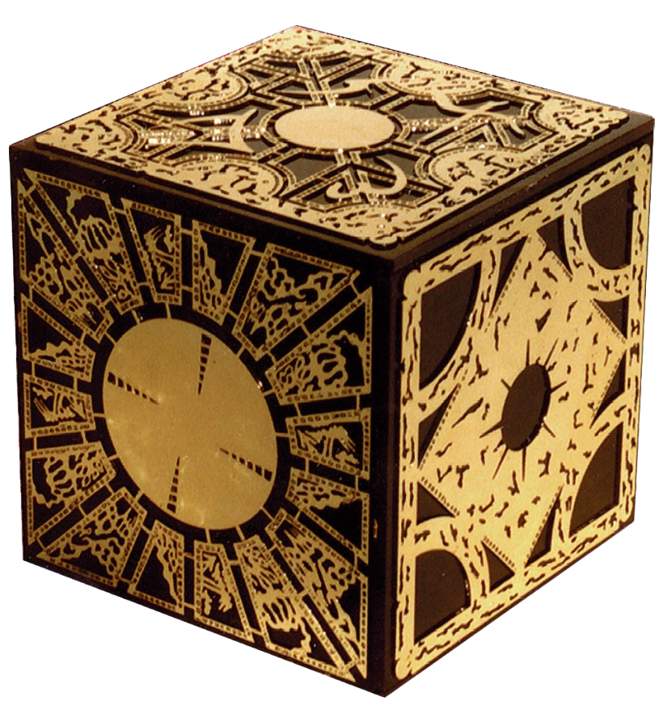

Though a magic item in and of itself, this cubic box often contains far more powerful and destructive items. The puzzle box can hold one cubic foot of contents, which can’t be targeted by divination spells or perceived through scrying sensors created by divination spells.

Once the box is closed, it can only be opened by solving the box’s puzzle. You can attempt to solve it by spending 24 hours working on the puzzle mechanism, after which you must succeed a DC 32 Intelligence check to open the box. You can close the box as an action, automatically scrambling the puzzle.

