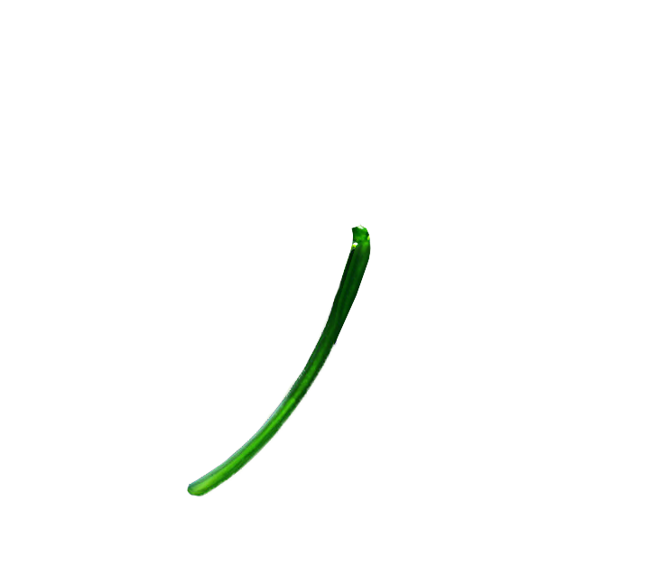

# Other Magic Items

## Edmund’s Eye Patch
**Wondrous Item, rare (requires attunement)**

While wearing this eye patch, you gain these benefits:
You have advantage on Wisdom (Perception) checks that rely on sight.
If you have the Sunlight Sensitivity trait, you are unaffected by the trait.
You are immune to magic that allows other creatures to read your thoughts or determine whether you are lying. Creatures can communicate telepathically with you only if you allow it.

## Dust of Sleeping
**Wondrous Item, rare**

Usually found in a small leather sack, this powder resembles fine, white sand. There is enough of it for one use. When you use an action to throw a handful of the dust into the air, each creature that needs to breathe within 10 feet of you must succeed on a DC 15 Constitution saving throw or fall unconscious for 1 minute, until the sleeper takes damage, or someone uses an action to shake or slap the sleeper awake. You are immune to the effect.

## Boots of the Trail
**Wondrous Item, uncommon**

Until they are worn, the boots of the trail appear to be in grave disrepair. When you lace them up, the illusion fades: they are immaculate hiking boots with gold clasps and silk laces. While wearing these boots, you leave behind no tracks or other traces of your passage, and can’t be tracked except by magical means. You can march for twice as long before suffering levels of exhaustion.
Additionally, you can remove the boots and speak a command word (Vroom vroom) as an action to cause the boots to walk alone, leaving a false trail in any direction for up to one mile. The boots then teleport back to your feet.

## Cane of Youth
**Wondrous Item, uncommon (requires attunement)**

While attuned to this cane, you suffer none of the frailty of old age and can’t be aged magically. You can still die of old age, however.

## Bracelet of Animal Speech
**Wondrous Item, rare (requires attunement)**

When you place this item on your wrist, you gain the ability to comprehend and verbally communicate with one beast of your choice. A side effect is that you can no longer speak any other language, but can only make the noise, such as a bark or meow, of the last beast you spoke to.This effect lasts while you have the bracelet on your wrist.
The knowledge and awareness of many beasts is limited by their intelligence, but at minimum, beasts can give you information about nearby locations and monsters, including whatever they can perceive or have perceived within the past day. You might be able to persuade a beast to perform a small favor for you, at the DM’s discretion.

## Key of Opening
**Wondrous item, uncommon (6)**

This bronze key has a head shaped like a crown. When inserted into a non magical lock and twisted, the key expends a charge and opens the lock. The key has 6 charges when found and becomes non magical when you use the last charge.

## Exploding Armor
**Armor (medium, half plate), rare (requires attunement)**

While wearing this armor, you can use your action to cast fireball (save DC 15), centered on yourself. You take no damage from this spell. The armor cant be used this way again until the next dawn.

## Magical Leaf Stem
**Wondrous item, common**

It's a magical stem. Wat du hek?

