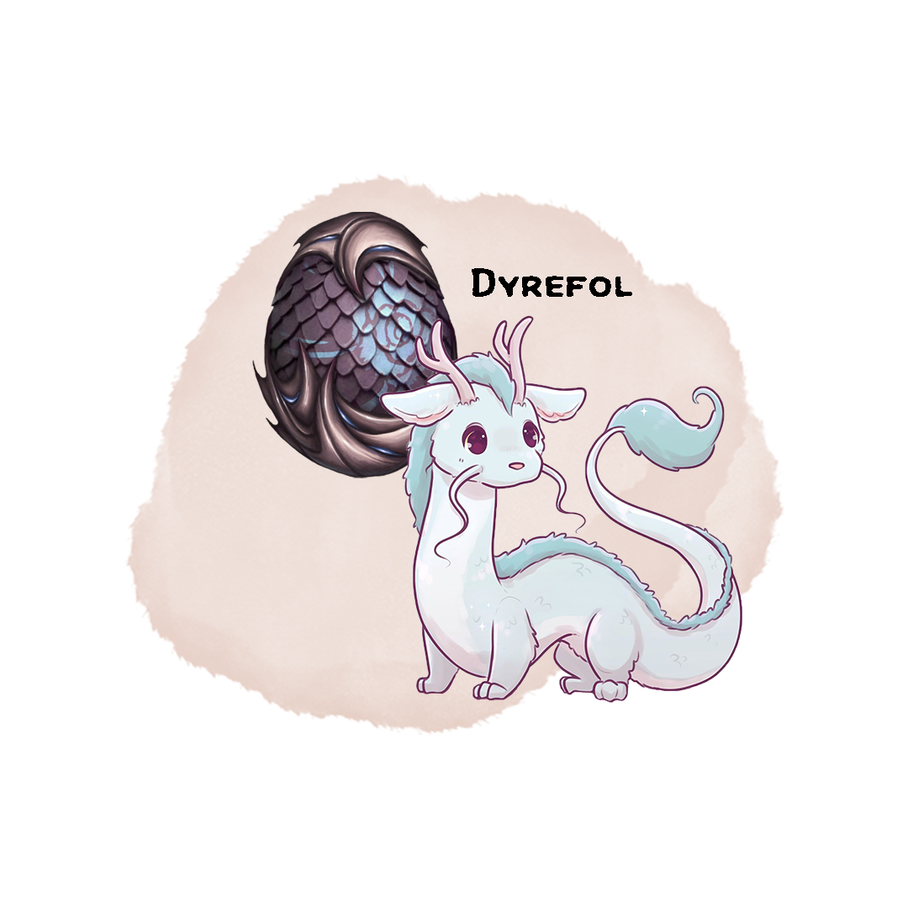

# Dyrefol, Eternal Companion
## Wondrous Item, Artifact (requires attunement by Nyx Strixbloom)

Separated at birth from his clutch, Dyrefol has always led a lonely life. Throughout his travels, Dyrefol has met countless individuals who sought to use his power for their own gain. Though few mistreated him, none of them made Dyrefol feel at home. He continues to search for someone whom he not only calls master, but also friend.

## Might of the Infusion
At any time, Dyrefol is in one of three states: Dormant, Resting, or Awake.

While Dyrefol is within 300 feet of you, you gain a +2 to spell attack rolls and spell save DCs.

## Everlasting Bond
You lose the ability to conjure a familiar and cast the find familiar spell.
Once per short or long rest, as a bonus action, you may expend a use of Wild Shape to awaken Dyrefol. Dyrefol returns to being dormant whenever you take a short or long rest.
You may summon or dismiss Dyrefol as a bonus action, which transports him to or from his own ethereal plane. When you summon Dyrefol he appears in an unoccupied space within 30 feet of you. Dyrefol’s level is equal to your own level. You must be within 300 feet of Dyrefol to dismiss him.

## Loyal Companion
If Dyrefol is ever reduced to 0 hit points, he starts to rest.

While in his resting state, Dyrefol has the following properties:

* He takes on the appearance of a spirit egg
* He cannot take any actions, move, or be moved
* He is ethereal
* He is immune to all damage and harmful effects

While in his active state, Dyrefol has the following properties:

* He has his own stat block and has his own initiative during combat.
* He can communicate with you telepathically while within 300 feet.
* As an action, you can mind link with Dyrefol, gaining access to his senses.
* When you cast a spell with a range other than self, the spell can originate from Dyrefol if he is within 300 feet of you.
* Once per long rest, at the start of his turn, you may take over Dyrefol, and take his turn. During this time you have access to all of Dyrefol’s abilities as well as your own spells and features. Any spells you cast use your own spell attack and spell save DC, but you do not have access to magic items attuned to yourself aside from Dyrefol. Any resources you spend are still consumed from you.

In order to wake Dyrefol up from his resting state, you can expend another use of your wildshape feature (as a bonus action), or heal him to his maximum hit points.

## Elemental Residue
When a spell or non-martial feature would deal acid, cold, fire, lightning, radiant, or necrotic damage within 60 feet, Dyrefol may use his reaction to channel some of that energy. The next time a spell is cast through Dyrefol or he makes an attack, he may add 1d4 of that element to the damage or healing of that spell or attack. When Dyrefol channels new energy, any old energy is lost.

## Elemental Assault Level 1
Dyrefol is a 1st level spellcaster and learns 3 elemental cantrips and 1 elemental 1st level spell of your choice. Chosen:

* Shocking Grasp
* Fire Bolt
* Primal Savagery

* Burning Hands
