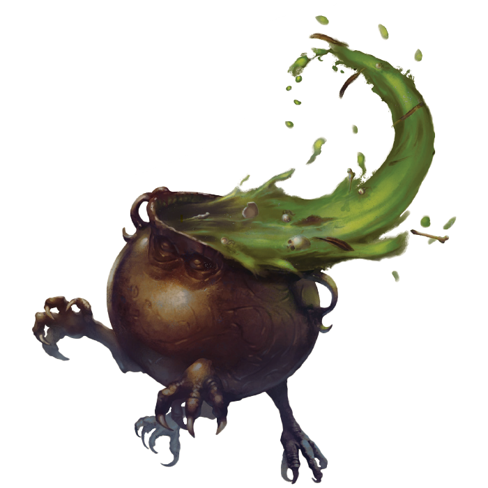

# Kaban, Catalyst of Creation
## Wondrous Item, Artifact (requires attunement by Nyx Strixbloom)

Once belonging to a powerful witch, Kaban has since been passed down between countless mages, but none have yet to master its potential.

## A Cook for Every Occasion
You may use Kaban as Alchemist’s supplies, Brewer’s supplies, Cook’s utensils, Herbalism kit, and Poisoner’s kit. You may also mix and match its uses, such as creating food with the effects of a healing potion. When using Kaban this way, Wisdom is your ability modifier and you are considered proficient.

## No Added Preservatives
If you don’t wish to extract a brew, Kaban is capable of preserving, remembering, and recalling any brew currently inside it in its own vial dimension. As a bonus action, you may have Kaban drain whatever it currently has inside into its vial dimension and recall something back or simply start a new brew. Kaban can store a number of brews this way equal to your proficiency bonus. Each of Kaban's brews, unless otherwise stated, have a volume equal to your proficiency bonus number of vials.

## Magical Concoction (Level 1)
You may cast a spell into Kaban to create a magical brew. You may stir this brew for 10 minutes to imbue a special effect into it from the following options:

* Replace the spell with any spell from the Druid spell list of an equal or lower level
* Double the duration of the spell
* Double the area of the spell
* Double the range of the spell
* Change the area of the spell
* Change the saving throw of the spell

You may cast this spell from Kaban as you would normally cast a spell. When you do, the spell is cast as if it were one level higher and has the chosen effect. The brew need not be the active brew in order to cast it.

You may only add one effect to the brew and Kaban may only have one magical brew at any given time and one vial's worth.

## Mirror, Mirror (Level 1)
By supplying some part of a living creature or an item from a specific location and stirring Kaban for 10 minutes, Kaban’s water becomes a viewport of the creature or location as though you cast the Scrying spell. Unlike the scrying spell, you cannot hear the creature or location. The part used when stirring affects the DC of the Wisdom save made as part of the Scrying spell according to the “Connection” table. You do not need to maintain concentration for the effect.

You can use this feature of Kaban once per long rest.

