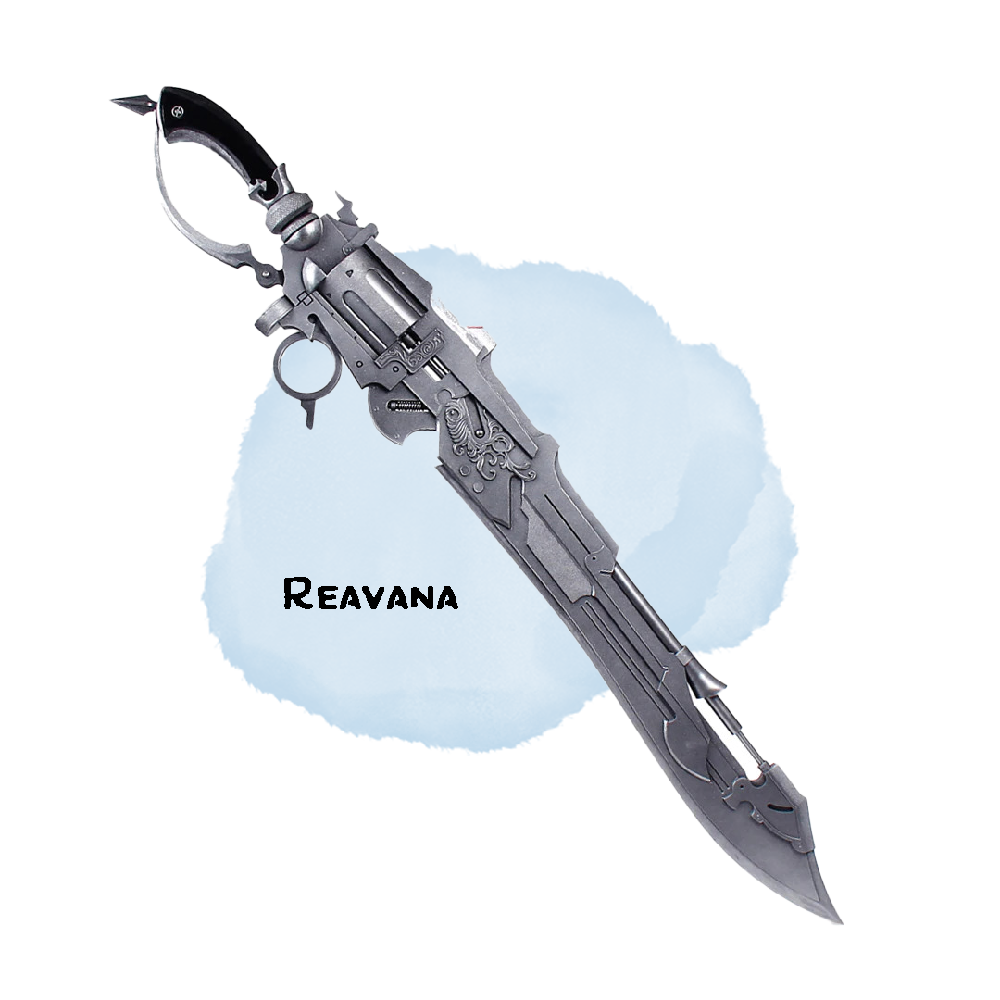

# Reavana, Executioner of the Damned
## Weapon (Gunblade), Artifact (requires attunement by Felix Burkheart)

Striving to reach new heights, the best dwarven and elven engineers joined forces to create something never seen before. Using the finest elven steel along with the dwarves’ refined firearm craftsmanship, Reavana was brought into existence. Unfortunately, arguments about credit for Reavana’s creation resulted in it being the only one ever made.

## Might of the Infusion
While wielding Reavana, you have a +2 to your spell attack rolls and spell save DC

## A Novel Construction
Reavana is the only one of its kind. In addition to being a spellcasting focus for you, it can also function as a sword and a firearm. You use your dexterity bonus for the attack.

When used as a sword, it deals 1d12 + dexterity modifier slashing damage

When used as a firearm, it deals 1d10 + dexterity modifier piercing damage

The firearm uses special bullets (4g per 20), has 60/240 range, and can fire 6 bullets before reloading. On your turn, you may use a bonus action to reload Reavana if its chamber is not full.

## One in the Chamber
Every time you cast a leveled spell, Reavana gains a number of stacks equal to the level of the spell. When you land an attack with a bullet, you may choose to spend your stacks and deal an additional d6 fire damage for every stack. Your stacks get reset to 0 after taking a short rest. You may only use this feature once per long rest.

## Arcane Shot Level 2
When you complete a long rest you can store one of your artificer spells of level 2 or lower you know into Reavana by casting it using one of your spell slots and expending any necessary components. As a bonus action, you can fire the spell from Reavana as if it were a bullet without expending a spell slot and ignoring any verbal, somatic, or material components. Treat the range of a spell fired this way as the same range as Reavana’s gunshot. You can cast another spell normally using your action on the same turn you use this feature.
