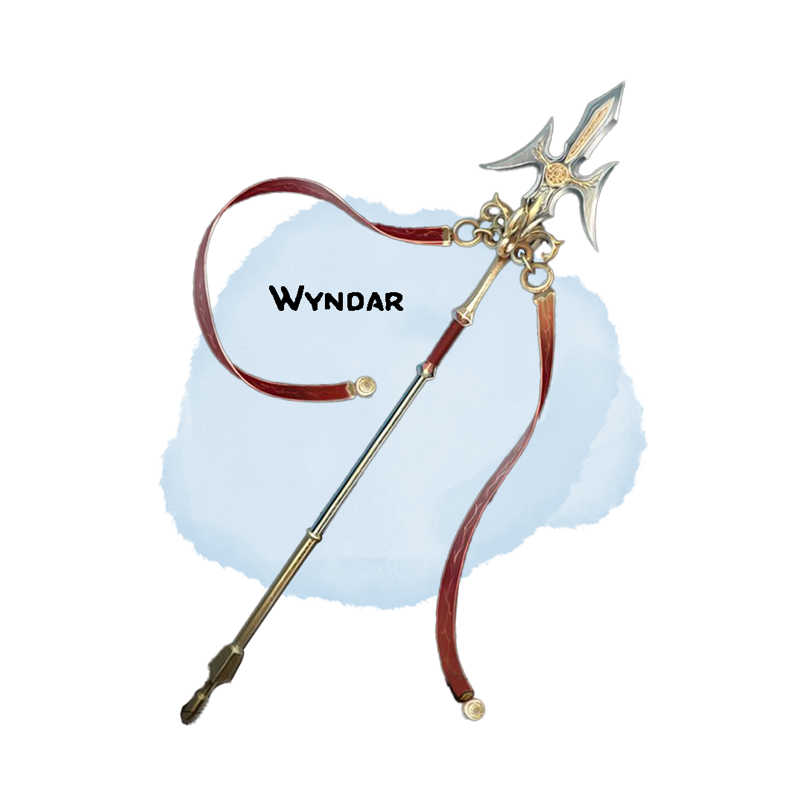

# Wyndar, Emblem of Change
## Weapon (Polearm), Artifact (requires attunement by Freki Ulfheonar)

<!-- 
 -->

Forged by the legendary changeling blacksmith Wyndar, his name sake weapon is imbued with some of his very life essence, allowing it to change and adapt to the situation at hand. Only one deemed worthy of Wyndar can reach its true potential.
<!-- 
 -->

## Might of the Infusion
Wyndar has a +2 bonus to attack and damage rolls made with it.

## Changeling Adaptability
You may change the type of polearm (or similar weapon)  Wyndar represents at will, gaining all the properties associated with them. You may choose from the following weapons: Glaive, Halberd, Lance, Pike, Quarterstaff, Longspear, or Spear. Any of these weapons can be used with Polearm Master.

## Evolutionary Decay
Your action surge(s) are replaced by decaying rampage. When you first activate decaying rampage, you may take the attack action once again that turn. Every subsequent turn you may reactivate the ability, but you get one less attack during your additional attack action. If you do not activate decaying rampage on a subsequent turn, the effect ends early. The effect ends when you would not gain any additional attacks. Any extra attacks that come from decaying rampage do an additional 1d10 force damage.

## Return Strike Level 1
Wyndar gains the thrown property in each of its forms. At the end of your turn, if Wyndar is not in your possession you can use your reaction to have it return directly to your hands. Any creature it passes through must make a DC 14 Dexterity saving throw or take damage as if you had struck them with Wyndar in its current form, applying any relevant modifiers and effects. If Wyndar collides with impassable terrain, it stops moving towards you. You can use this ability a number of times equal to your proficiency bonus per long rest.
